# 리소스 제거

---

## 1. 배포 환경 리소스 제거

1. Cloudformation 페이지에서 **"CodeEditorStack"** 스택에 진입합니다.

    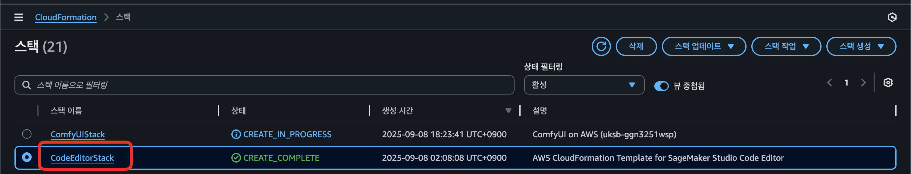

2. Cloudformation 스택 페이지에서 **"삭제"** 버튼을 클릭해 배포 삭제를 진행합니다.

    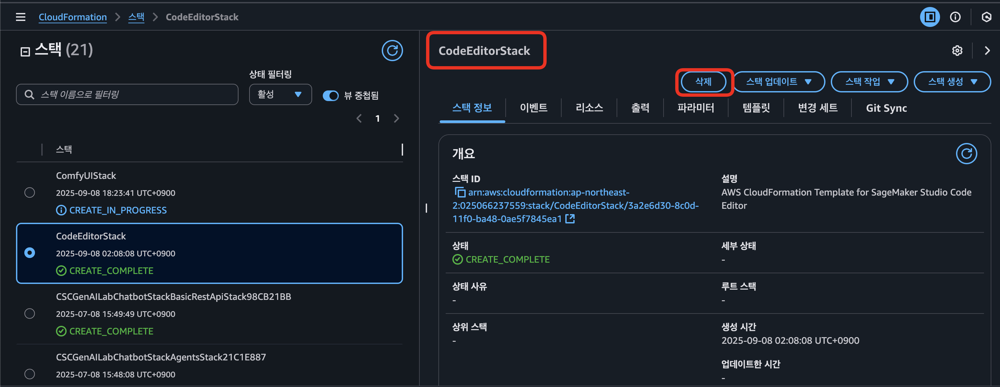

3. 상태가 **"DELETE\_COMPLETE"**가 되었다면 정상적으로 모든 리소스가 삭제된 것입니다.

    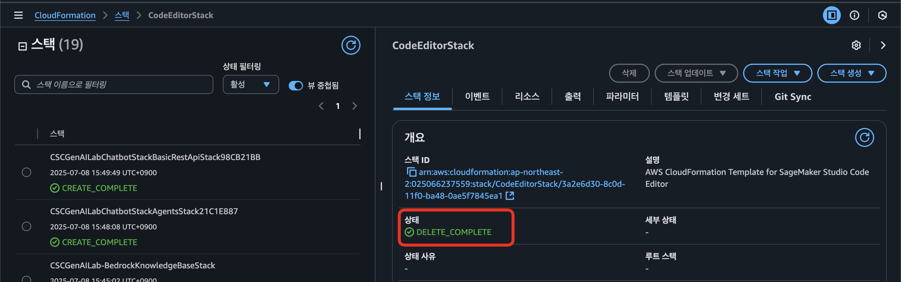

---

## 2. ComfyUI 리소스 제거

1. Cloudformation 페이지에서 **"ComfyUIStack-xxx"** 스택에 진입합니다.

    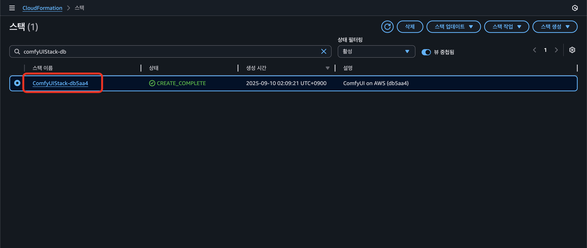

2. Cloudformation 스택 페이지에서 **"삭제"** 버튼을 클릭해 배포 삭제를 진행합니다.

    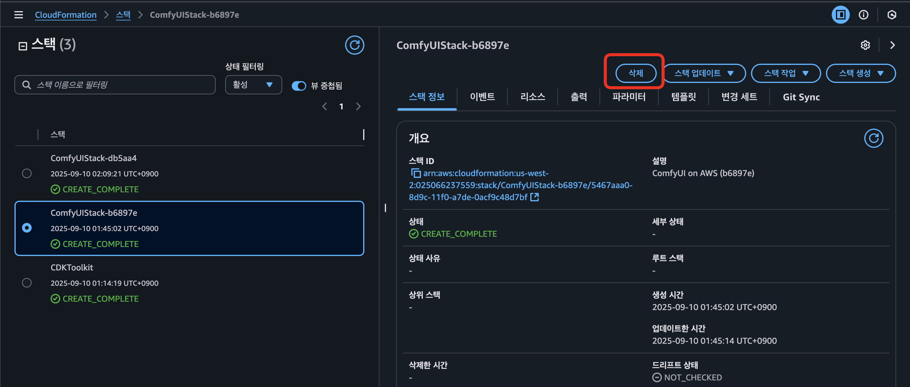

3. EBS 볼륨 삭제\
   EC2 → 볼륨 페이지에서 ComfyUIVolume-xxx 이름의 EBS 볼륨을 삭제합니다.

    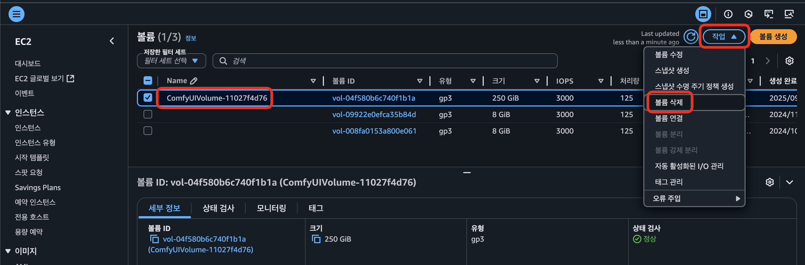

4. Cognito 삭제\
   Cognito → 사용자 풀 페이지에서 ComfyUIuserPool-xxx 이름의 사용자 풀을 삭제합니다.

    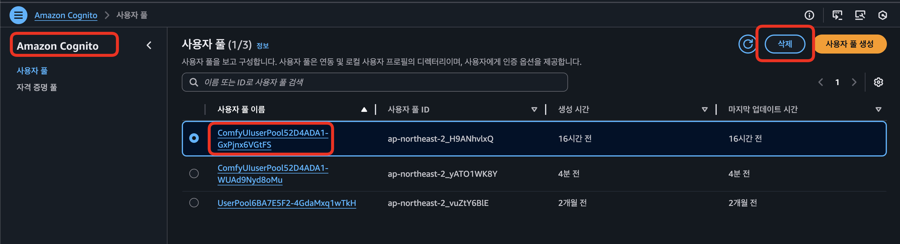

### ⚠️ Cloudformation 스택에서 제거되지 않은 리소스가 존재할 경우

1. Cloudformation 스택 삭제가 정상적으로 진행되지 않은 경우, 아래와 같이 상태가 **"DELETE\_FAILED"**가 됩니다.

    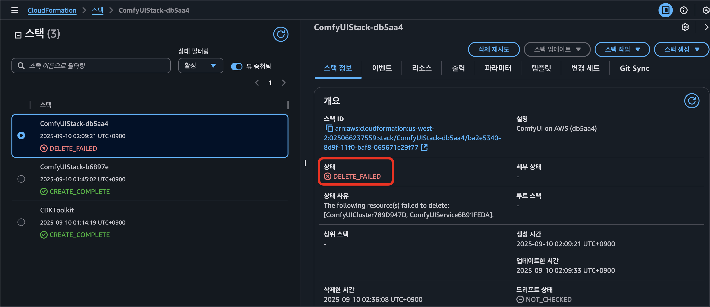

2. 이 경우 Cloudformation 스택에서 **"삭제 재시도"**를 수행합니다.

    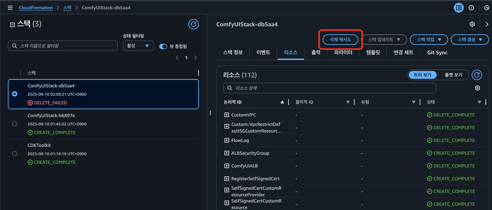

3. 특정 리소스가 몇 분째 **"DELETE\_IN\_PROGRESS"** 상태라면, 문제가 되는 리소스를 직접 삭제합니다.

    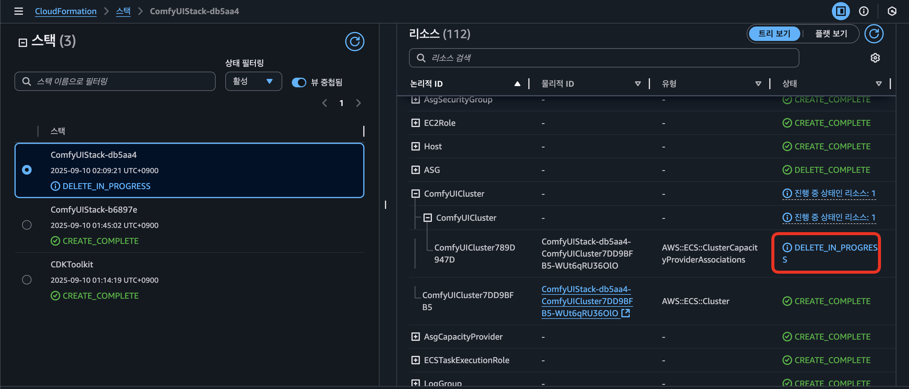

4. 상태가 **"DELETE\_COMPLETE"**가 되었다면 정상적으로 모든 리소스가 삭제된 것입니다.

    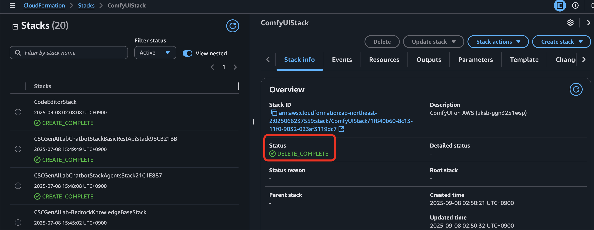
